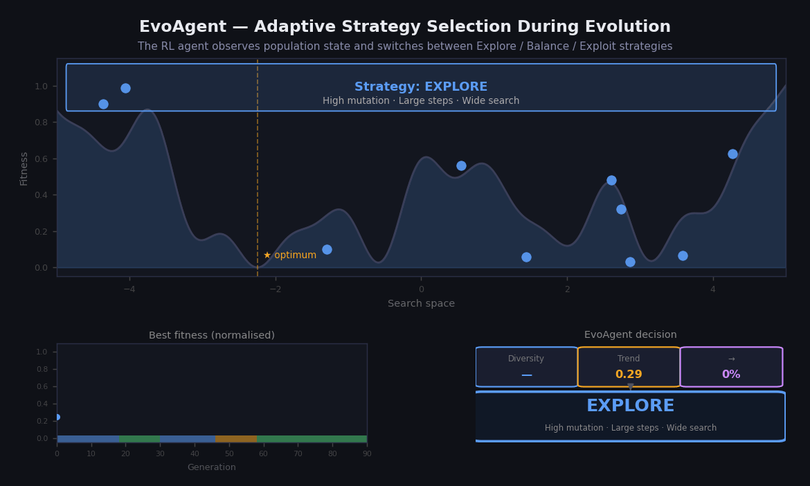

# REKEASE (EvoAgent)

## RELEASE: Reinforcement Learning for Adaptive Strategy Selection in Evolutionary Algorithms

EvoAgent is a general-purpose reinforcement learning framework that dynamically controls evolutionary algorithms through intelligent strategy selection. The framework employs a learning agent to adaptively choose evolutionary operators and hyperparameter configurations based on the current state of the optimization process, enabling an effective balance between exploration and exploitation.

Unlike traditional evolutionary algorithms that rely on fixed parameter settings, EvoAgent continuously learns from previous search experiences and adapts its behavior online to improve optimization performance, avoid premature convergence, and enhance solution quality.

---

## Overview

EvoAgent treats the optimization process as a sequential decision-making problem in which a reinforcement learning agent learns how to guide the evolutionary search.

At each generation:

1. The agent observes the current state of the population.
2. The agent selects an evolutionary strategy.
3. The selected strategy is applied.
4. The environment returns a reward based on optimization progress.
5. The agent updates its knowledge for future decisions.

The framework is designed to be independent of any specific evolutionary algorithm and can be integrated with a wide range of optimization methods.

 

---

## Key Features

- Reinforcement learning-based Agent
- Adaptive operator selection
- Dynamic hyperparameter tuning
- Exploration and exploitation balancing
- Population state awareness
- Algorithm-independent architecture
- Prevention of premature convergence
- Scalable and extensible design

---

## Framework Components

### State Representation

Typical state features include:

- Population diversity
- Best fitness value
- Average fitness value
- Fitness improvement rate
- Stagnation level
- Convergence indicators

### Action Space

Actions may include:

- Selection operators
- Crossover operators
- Mutation operators
- Search strategies
- Parameter configurations
- Exploration and exploitation policies

### Reward Function

Rewards can be based on:

- Fitness improvement
- Diversity preservation
- Convergence quality
- Search efficiency

---

## Supported Evolutionary Algorithms

EvoAgent can be integrated with:

- Genetic Algorithms (GA)
- Quantum-Inspired Genetic Algorithms (QGA)
- Differential Evolution (DE)
- Evolution Strategies (ES)
- Particle Swarm Optimization (PSO)
- Memetic Algorithms
- Multi-Objective Evolutionary Algorithms
- Other population-based metaheuristics

 
